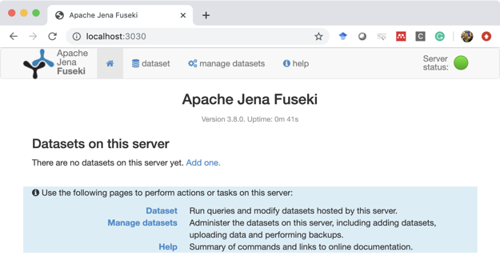
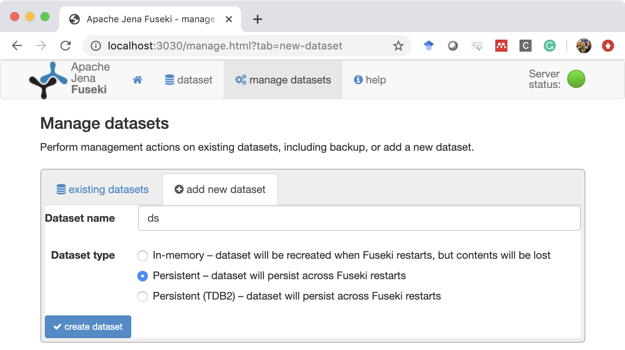
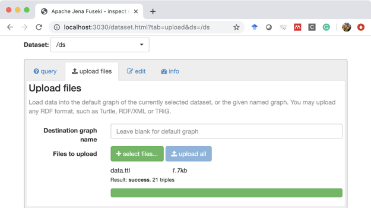
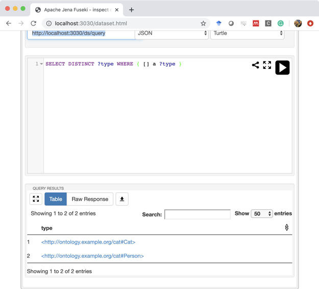

# Serving Linked Data: A Step-by-Step Tutorial
Christophe Debruyne  
ADAPT, Trinity College Dublin  
WISE, Vrije Universiteit Brussel

# 1 Introduction
The goal of this document is to provide you with step-by-step instructions for serving your data and ontology as Linked Data. This document by no means claims to provide the way for publishing those resources as such but may provide a basis.

This tutorial comes with two files; a file containing a cat ontology ([ontology.ttl](/files/ontology.ttl)) and a file containing instances ([data.ttl](/files/data.ttl)). You will notice that the domain of the ontology is ontology.example.org and the domain of the resources is data.example.org. This is a way of separating data and ontologies, but not the way. We will set up a Linked Data frontend that resembles http://dbpedia.org/. We will set up our local machine to listen to those domains step by step.

We will first set up the Linked Data frontend for the data. Then we will set up the frontend for the ontology. We finally make the necessary changes to serve both at the same time using one machine.

# 2 Serving the Data as Linked Data
## 2.1 Requirements
*	Important: I assume you have both the Java SDK and Maven installed!
*	[Apache Jena Fuseki](https://jena.apache.org/documentation/fuseki2/index.html) or any other SPARQL endpoint
*	[Jetty](https://www.eclipse.org/jetty/download.html), a Web Server written in Java
*	[Pubby](https://github.com/cygri/pubby), generic Linked Data frontend


## 2.2 Configuring the hosts file
For this tutorial, we will host all frontends on our local machine (127.0.0.1). So we first need to “trick” our computer into thinking that the domain `data.example.org` refers to our machine. We thus need to change our hosts file. You will likely need admin privileges for this.

```bash
$ sudo pico /etc/hosts
```

And add the following line

`127.0.0.1 data.example.org`

Note: On windows, you should be able to find the file at `c:\Windows\System32\Drivers\etc\hosts`. Again, you will need admin privileges to edit that file.

## 2.3 Setting up the SPARQL Endpoint
Download and unzip Apache Jena Fuseki. Go inside the folder and start Fuseki. By default, it will run on port 3030, which is for the purpose of this tutorial fine.

```bash
$ ./fuseki-server
```

Go to http://localhost:3030/ and you should the following screen.



Go to "manage datasets" and add a new dataset "ds" that is persistent. You can use an in-memory dataset, but then you will lose all information upon restarting Fuseki.



Once the dataset is created, you can upload `data.ttl` containing the instances. We will load them in the default graph.



You should be able to click on the menu “dataset” and choose the dataset “ds”. Notice that the URI of the SPARQL endpoint is http://localhost:3030/ds/query. This will be important later on. You can test whether the triples have been correctly uploaded by formulating a query. For instance:

```SPARQL
SELECT DISTINCT ?type WHERE { [] a ?type }
```



## 2.4 Setting up Jetty and Pubby
Jetty is a simple Web server, written in Java, and Java Servlet container. Pubby is our generic Linked Data frontend. While Pubby comes with Jetty and can be run as such from a terminal, we will compile and package Pubby and run Pubby from our own Jetty container. This allows us to have a bit more control.

First we download and unzip Jetty. Then we download or clone Pubby. We will create the package inside the Pubby folder. It is likely that mvn will complain when generating documentation. We can avoid this by skipping the generation of documentation with the following command:

```bash
$ mvn package -DskipTests -Dmaven.javadoc.skip=true
```

You will notice that mvn created a package (`./target/pubby.war`). The contents of that WAR are also in the folder `./target/pubby`. Rename that directory to `ROOT` and place that directory in the `./webapp/` folder of Jetty. A web application in a folder called “ROOT” will be treated as running from the domain `data.example.org`.

Before we start Jetty, we will first need to configure Pubby. Pubby contains a configuration file that indicates how and where the data is to be found. The file is located at `./ROOT/WEB-INF/config.ttl`. Replace the contents with the following:

```
# Prefix declarations to be used in RDF output
@prefix conf: <http://richard.cyganiak.de/2007/pubby/config.rdf#> .
@prefix cat: <http://ontology.example.org/cat#> .
@prefix rdf: <http://www.w3.org/1999/02/22-rdf-syntax-ns#> .
@prefix rdfs: <http://www.w3.org/2000/01/rdf-schema#> .
@prefix xsd: <http://www.w3.org/2001/XMLSchema#> .
@prefix owl: <http://www.w3.org/2002/07/owl#> .

# Server configuration section
<> a conf:Configuration ;
  conf:projectName "Linked Data Tutorial" ;
  conf:projectHomepage <http://www.example.org/> ;
  conf:webBase <http://data.example.org/> ;
  conf:usePrefixesFrom <> ;
  conf:defaultLanguage "en" ;

  conf:dataset [
    conf:sparqlEndpoint <http://localhost:3030/ds/sparql> ;
    conf:datasetBase <http://data.example.org/> ;          	
    conf:fixUnescapedCharacters "(),'!$&*+;=@" ;
    conf:resourceDescriptionQuery "DESCRIBE ?__this__" ;
  ] ;
.
```

We included the namespace of our ontology and qualified it with the prefix `cat:`. With `conf:usePrefixesFrom <>`, we indicate that Pubby should use this file for its prefixes. Finally, we also need to point to the SPARQL endpoint from which data will be retrieved.

We now go the Jetty folder and run Jetty from the command line. De default port of Jetty is 8080, but we will run it from port 80. It might be that you need admin privileges to run Jetty on port 80. If that is the case, you may need to either change privileges or run Jetty as an admin.

```bash
$ java -jar start.jar -Djetty.port=80
```

If we visit http://data.example.org/, we will now see that our resources are available with Linked Data principles. Following the URI for the Non-information Resource http://data.example.org/resource/cat/1 will redirect us to the Information Resource (Web page) describing that NIR with URI http://data.example.org/page/resource/cat/1.


If you want backlinks, you can add the following query to the configuration:

```
conf:resourceDescriptionQuery "CONSTRUCT { ?s ?p ?__this__ } WHERE { ?s ?p ?__this__ }" ;
```

# License
This work is licensed under a [Creative Commons Attribution-NonCommercial-ShareAlike 4.0 International License](https://creativecommons.org/licenses/by-nc-sa/4.0/).
