# Serving Linked Data: A Step-by-Step Tutorial

[Christophe Debruyne ](http://christophedebruyne.be/)  
---
[ADAPT](https://www.adaptcentre.ie/), [Trinity College Dublin](https://www.tcd.ie/)  
[WISE](https://wise.vub.ac.be/), [Vrije Universiteit Brussel](https://www.vub.be/)

# 1 Introduction
The goal of this document is to provide you with step-by-step instructions for serving your data and ontology as Linked Data. This document by no means claims to provide the way for publishing those resources as such but may provide a basis.

This tutorial comes with two files; a file containing a cat ontology ([ontology.ttl](/files/ontology.ttl)) and a file containing instances ([data.ttl](/files/data.ttl)). You will notice that the domain of the ontology is ontology.example.org and the domain of the resources is data.example.org. This is a way of separating data and ontologies, but not the way. We will set up a Linked Data frontend that resembles http://dbpedia.org/. We will set up our local machine to listen to those domains step by step.

We will first set up the Linked Data frontend for the data. Then we will set up the frontend for the ontology. We finally make the necessary changes to serve both at the same time using one machine.

# 2 Serving the Data as Linked Data
## 2.1 Requirements
*	Important: I assume you have both the Java SDK and Maven installed!
*	[Apache Jena Fuseki](https://jena.apache.org/documentation/fuseki2/index.html) or any other SPARQL endpoint
*	[Jetty](https://www.eclipse.org/jetty/download.html), a Web Server written in Java
*	[Pubby](https://github.com/cygri/pubby), generic Linked Data frontend


## 2.2 Configuring the hosts file
For this tutorial, we will host all frontends on our local machine (127.0.0.1). So we first need to “trick” our computer into thinking that the domain `data.example.org` refers to our machine. We thus need to change our hosts file. You will likely need admin privileges for this.

```bash
$ sudo pico /etc/hosts
```

And add the following line (on a new line):

`127.0.0.1 data.example.org`

Note: On windows, you should be able to find the file at `c:\Windows\System32\Drivers\etc\hosts`. Again, you will need admin privileges to edit that file.

## 2.3 Setting up the SPARQL Endpoint
Download and unzip Apache Jena Fuseki. Go inside the folder and start Fuseki. By default, it will run on port 3030, which is for the purpose of this tutorial fine.

```bash
$ ./fuseki-server
```

Go to http://localhost:3030/ and you should the following screen.


Go to "manage datasets" and add a new dataset "ds" that is persistent. You can use an in-memory dataset, but then you will lose all information upon restarting Fuseki.


Once the dataset is created, you can upload `data.ttl` containing the instances. We will load them in the default graph.


You should be able to click on the menu “dataset” and choose the dataset “ds”. Notice that the URI of the SPARQL endpoint is http://localhost:3030/ds/query. This will be important later on. You can test whether the triples have been correctly uploaded by formulating a query. For instance:

```SPARQL
SELECT DISTINCT ?type WHERE { [] a ?type }
```


## 2.4 Setting up Jetty and Pubby
Jetty is a simple web server, written in Java, and Java Servlet container. Pubby is our generic Linked Data frontend. While Pubby comes with Jetty and can be run as such from a terminal, we will compile and package Pubby and run Pubby from our own Jetty container. This allows us to have a bit more control.

First we download and unzip Jetty. Then we download or clone Pubby. We will create the package inside the Pubby folder. It is likely that mvn will complain when generating documentation. We can avoid this by skipping the generation of documentation with the following command:

```bash
$ mvn package -DskipTests -Dmaven.javadoc.skip=true
```

(If the build failed and show something like *"Source option 6 is no longer supported. Use 7 or later."*, you probably use a too recent JDK. Downgrading JDK version may fix this. Changing [source or target of Java compiler](http://maven.apache.org/plugins/maven-compiler-plugin/examples/set-compiler-source-and-target.html) will not help in this case, unfortunately. JDK 8 should work fine.)

You will notice that mvn created a package (`./target/pubby.war`). The contents of that WAR are also in the folder `./target/pubby`. Rename that directory to `ROOT` and place that directory in the `./webapps/` folder of Jetty. A web application in a folder called “ROOT” will be treated as running from the domain `data.example.org`.

Before we start Jetty, we will first need to configure Pubby. Pubby contains a configuration file that indicates how and where the data is to be found. The file is located at `./ROOT/WEB-INF/config.ttl`. Replace the contents with the following:

```
# Prefix declarations to be used in RDF output
@prefix conf: <http://richard.cyganiak.de/2007/pubby/config.rdf#> .
@prefix cat: <http://ontology.example.org/cat#> .
@prefix rdf: <http://www.w3.org/1999/02/22-rdf-syntax-ns#> .
@prefix rdfs: <http://www.w3.org/2000/01/rdf-schema#> .
@prefix xsd: <http://www.w3.org/2001/XMLSchema#> .
@prefix owl: <http://www.w3.org/2002/07/owl#> .

# Server configuration section
<> a conf:Configuration ;
  conf:projectName "Linked Data Tutorial" ;
  conf:projectHomepage <http://www.example.org/> ;
  conf:webBase <http://data.example.org/> ;
  conf:usePrefixesFrom <> ;
  conf:defaultLanguage "en" ;

  conf:dataset [
    conf:sparqlEndpoint <http://localhost:3030/ds/sparql> ;
    conf:datasetBase <http://data.example.org/> ;          	
    conf:fixUnescapedCharacters "(),'!$&*+;=@" ;
    conf:resourceDescriptionQuery "DESCRIBE ?__this__" ;
  ] ;
.
```

We included the namespace of our ontology and qualified it with the prefix `cat:`. With `conf:usePrefixesFrom <>`, we indicate that Pubby should use this file for its prefixes. Finally, we also need to point to the SPARQL endpoint from which data will be retrieved.

We now go the Jetty folder and run Jetty from the command line. De default port of Jetty is 8080, but we will run it from port 80. It might be that you need admin privileges to run Jetty on port 80. If that is the case, you may need to either change privileges or run Jetty as an admin.

```bash
$ java -jar start.jar -Djetty.http.port=80
```

Please make sure that Fuseki server is still running.

If we visit http://data.example.org/, we will now see that our resources are available with Linked Data principles. Following the URI for the Non-information Resource http://data.example.org/resource/cat/1 will redirect us to the Information Resource (Web page) describing that NIR with URI http://data.example.org/page/resource/cat/1.


If you want backlinks, you can add the following query to the configuration:

```
conf:resourceDescriptionQuery "CONSTRUCT { ?s ?p ?__this__ } WHERE { ?s ?p ?__this__ }" ;
```

The results of the two resource description queries will be merged. Restart Jetty and you will now see the backlinks appear:

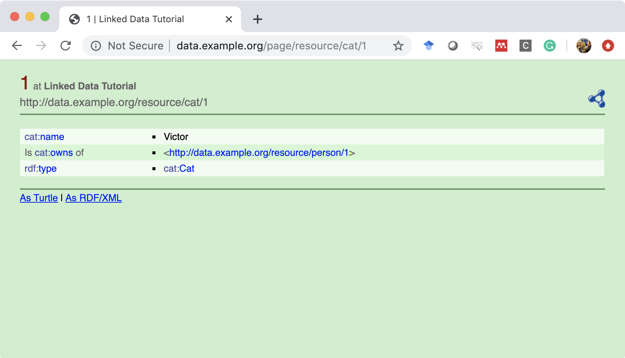

Congratulations, you have now set up your Linked Data frontend for your data. When you click on the URI of the predicate `cat:Cat`, however, you will see that it does not lead to anything yet. In the next chapter, we will service the ontology as Linked Data. 

# 3 Serving the Ontology as Linked Data

## 3.1 Requirements
*	We will use [WIDOCO](https://github.com/dgarijo/Widoco) to generate documentation and various RDF serializations of our ontology.
  * Reference: Garijo, D. (2017, October). WIDOCO: a wizard for documenting ontologies. In International Semantic Web Conference (pp. 94-102). Springer, Cham.

*	As WIDOCO generates a `.htaccess` file for Apache2, we will use MAMP, XAMP, or WAMP to host the ontology. In this tutorial, I use MAMP. It will be up to you to figure out where the various configuration files are based.

## 3.2 Stop Jetty
Jetty currently runs on port 80. We will run MAMP on port 80, but no two services can run on the same port. First stop Jetty and then start MAMP. In the next chapter, I will show how you can integrate both frontends.

## 3.3 Configuring the hosts file
For this tutorial, we will host all frontends on our local machine (127.0.0.1). So we first need to “trick” our computer into thinking that the domain `ontology.example.org` refers to our machine. We thus need to change our hosts file again.

```bash
$ sudo pico /etc/hosts
```

And add the following line (on a new line):

`127.0.0.1 ontology.example.org`

You should now have two entries; one for `data.example.org` and one for `ontology.example.org`.

## 3.4 Using WIDOCO
First, the base of the ontology is: http://ontology.example.org/cat. We will thus create a folder `cat` to be placed in the `htdocs` directory of our Apache2 Web server. This is not the way to do it. With this approach, however, you can host multiple ontologies under the same domain:

*	http://ontology.example.org/cat
*	http://ontology.example.org/foo
*	http://ontology.example.org/bar
*	...

Download WIDOCO; they provide an executable JAR file with all dependencies included. Double click on the JAR file to launch the GUI. In the first window:

* Choose to create documentation from the ontology file and look for `ontology.ttl`
* Select the location where you want to export the location (I have used a directory on my desktop)
* Give the project the name “cat”, which is important for the `.htaccess` file that will be generated

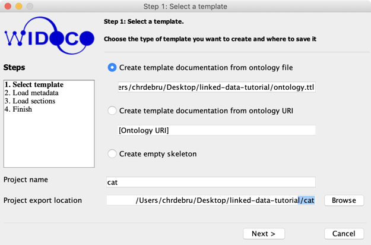

In the next step, you have the opportunity to fill in some values. For this tutorial, we will not fill in all bits and pieces, though it is encouraged to do so when you publish an ontology. In this tutorial, I will provide a name, title, and a namespace prefix:

* “My Cat Ontology” for both the title and name of the ontology, and
* “cat” for the prefix -- it corresponds with the prefix that we used for data.example.org. It is not necessary that the prefix corresponds with the one used for data.example.org, but it is helpful for users

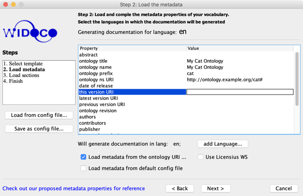

After that, click “Next”. You will have the option to include and load various sections in the documentation. While it is recommended to provide this information, we will skip this part for the sake of this tutorial. You can skip the third screen by clicking “Generate” and then finish by exiting the fourth screen.

The third screen | The final screen
------------ | -------------
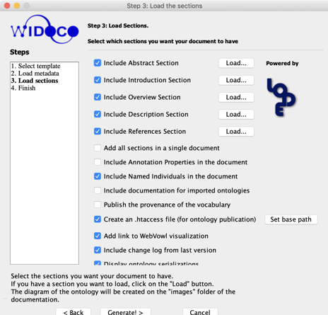 | 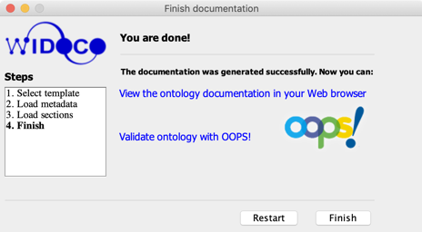

The folder which we have generated contains a bunch of files and folders; an HTML representation and various RDF serializations. One file is hidden, however: `.htaccess`. That file appears when you execute the command `ls -al` inside that directory (or by making invisible files visible in Windows).

Files in Finder | Listing the files with `ls -al`
------------ | -------------
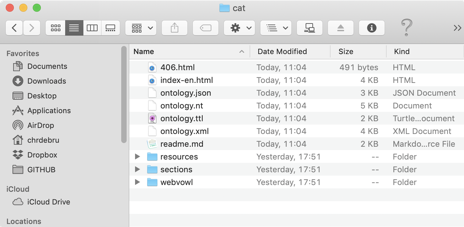 | 

The `.htaccess` file contains a bunch of rules implementing the content-negotiation. Below is a snipped of the contents of that file. The rewrite rules for serving TURTLE (TTL) content basically instruct the web server to act as follows: “if an agent requests either “text/turtle” or “text” or “turtle”, then redirect the agent to the TURTLE file.”

```
# Turn off MultiViews
Options -MultiViews

# Directive to ensure *.rdf files served as appropriate content type,
# if not present in main apache config
AddType application/rdf+xml .rdf
AddType application/rdf+xml .owl
AddType text/turtle .ttl
AddType application/n-triples .n3
AddType application/ld+json .json
# Rewrite engine setup
RewriteEngine On
#Change the path to the folder here
RewriteBase /cat

# Omitted for brevity

# Rewrite rule to serve TTL content from the vocabulary URI if requested
RewriteCond %{HTTP_ACCEPT} text/turtle [OR]
RewriteCond %{HTTP_ACCEPT} text/\* [OR]
RewriteCond %{HTTP_ACCEPT} \*/turtle
RewriteRule ^$ ontology.ttl [R=303,L]

RewriteCond %{HTTP_ACCEPT} .+
RewriteRule ^$ 406.html [R=406,L]
# Default response
# ---------------------------
# Rewrite rule to serve the RDF/XML content from the vocabulary URI by default
RewriteRule ^$ ontology.xml [R=303,L]
```
Move the directory `cat` to the `htdocs` folder of you MAMP installation and start the web server.

If you enter http://ontology.example.org/cat in the browser, you will be redirected to http://ontology.example.org/cat/index-en.html. And if you enter http://ontology.example.org/cat#Cat (the URI of our Cat concept), you will be redirected to http://ontology.example.org/cat/index-en.html#Cat. This demonstrates that we serve HTML per Linked Data principles!

Result of entering http://ontology.example.org/cat in the browser. | Result of entering http://ontology.example.org/cat#Cat in the browser.
------------ | -------------
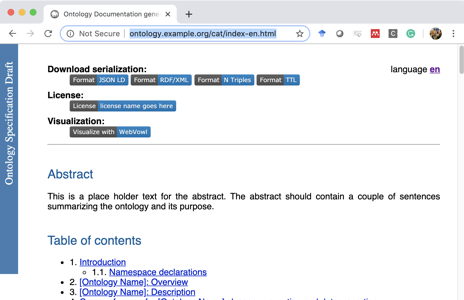 | 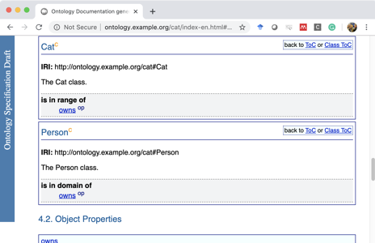

Let’s use cURL to test whether we obtain RDF. cURL is a command line tool used for transferring files.

```bash
$ curl -L -H "Accept: application/rdf+xml" –i http://ontology.example.org/cat#Cat
```

The options I use are:

*	`-L`	for accepting all redirects
*	`-H 	"Accept: application/rdf+xml"` for adding header information. I am looking for RDF/XML
*	`-i` 	Include the HTTP-header in the output

And this is the result:

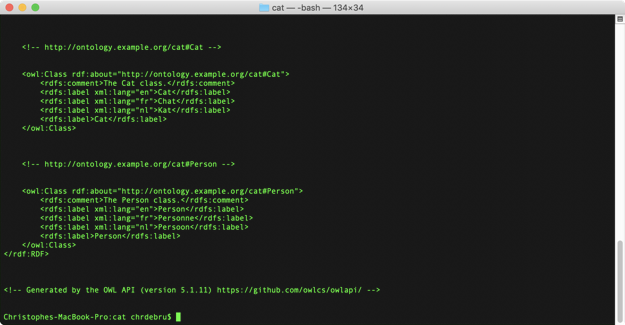

Remember from the Linked Data lecture the discussion on URI fragments. The ontology relies on fragments (`#Cat`, `#Person`, `#owns`, ... are all named nodes in the ontology). This means that the client “discard” the fragment while fetching the resource in which that named node is to be found. In other words: the whole file is downloaded (as you can see), but it is up to the client to find the named node. In a browser, the named node is used as an anchor. Let’s now request TURTLE and see the rewrite rules from the `.htaccess` being used:

```bash
$ curl -L -H "Accept: */turtle" –i http://ontology.example.org/cat#Cat
```

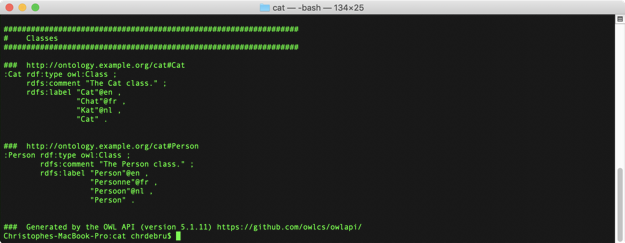

Now we published our ontology according to Linked Data principles. How do we now provide both the ontology and the data? We cannot have both Jetty and Apache2 listening on port 80. In the next section, I will show you how to tie everything together.

# 4 Serving the Ontology and Data as Linked Data

## 4.1 Requirements
*	You have followed the first two parts of the tutorial
*	Both Jetty and Apache2 are NOT running

## 4.2 Preambule
The gist of integrating both tutorials is to have the Linked Data frontend listening on a different port (e.g., 8080) and use Apache2 to listen to requests for data.example.org on port 80 and mediate those requests between the agent and the Jetty web server. This achieved with virtual hosts in one of the Apache2 configuration files. The location of the `httpd.conf` file, or the `httpd-vhosts.conf` file if you want to keep it separate depends on your xAMP installation. Be careful if you use the latter, however, the latter is not always included in the `httpd.conf` file. You may need to uncomment the following line:

`#Include /Applications/MAMP/conf/apache/extra/httpd-vhosts.conf`

For the purpose of this tutorial, however, I will add the following snippet to my `httpd.conf` file:

```
NameVirtualHost         *:80

<VirtualHost *:80>
    ProxyPreserveHost On
    ProxyPass / http://127.0.0.1:8080/
    ProxyPassReverse / http://127.0.0.1:8080/
    ServerName data.example.org
</VirtualHost>

<VirtualHost *:80>
    DocumentRoot "/Applications/MAMP/htdocs/"
    ServerName ontology.example.org
</VirtualHost>
```

This instructs the Apache2 server to create a virtual host listening to any domain on port 80 and:

* If the domain you aim to reach is data.example.org, then all incoming and outgoing requests are redirected to a web server (localhost) listening to port 8080.
* If you are listening to ontology.example.org, you are sent to the location containing or document.

Save these changes in the `httpd.conf` file and (re)start Apache2. Then start Jetty with the following command (be careful, I assume that Fuseki is already running):

```bash
$ java -jar start.jar
```

The default port of Jetty is 8080. Now let’s put http://data.example.org/resource/cat/1 in the address bar of the browser, and we are redirected to http://data.example.org/page/resource/cat/1.

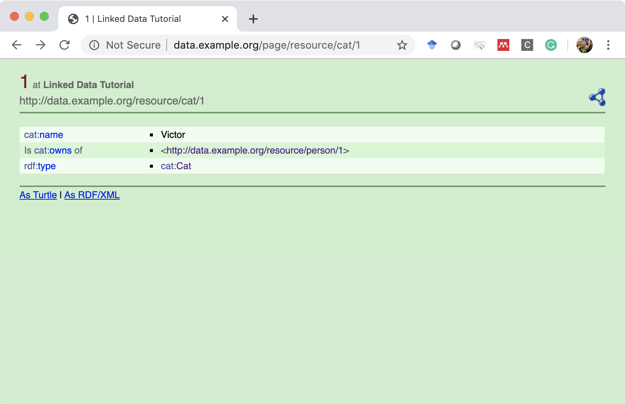

Notice that the description states that Victor is a cat (`rdf:type cat:Cat`). The `cat:Cat` is a hyperlink to http://ontology.example.org/cat#Cat, which is the URI of our Cat concept. Click on that link to follow that URI, and you will notice that you are now redirected to http://ontology.example.org/cat/index-en.html#Cat! Congratulations, you now serve both the data and the ontology and Linked Data on your local machine.

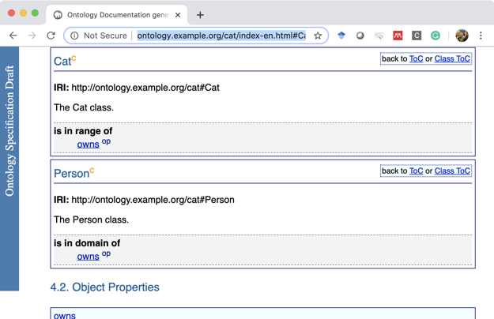

# 5 In Conclusion
With this tutorial, you should be able to set up a basic Linked Data Frontend that services both an ontology and data. I believe this tutorial is useful to better understand Linked Data and for setting up proof-of-concept frontends for student and research projects. Feel free to contact me with feedback.

# License
This work is licensed under a [Creative Commons Attribution-NonCommercial-ShareAlike 4.0 International License](https://creativecommons.org/licenses/by-nc-sa/4.0/).
